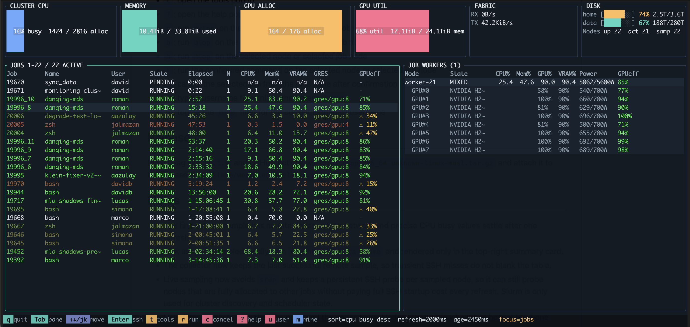

# ctop

A real-time Slurm cluster monitor for the terminal — think `htop` meets `nvtop`, but for your entire GPU cluster.



## Philosophy

Shared GPU clusters running Slurm are only as cost-effective as the jobs on them. An allocated-but-idle H100 still draws power, blocks other users, and wastes budget. `ctop` gives cluster operators and users a single view to answer: **which jobs are actually using the GPUs they reserved?**

- **Job-centric view.** Focus starts on the Slurm job queue, not the node list. Each job shows its CPU, memory, GPU VRAM, and efficiency at a glance. Select a job and its worker nodes appear on the right with per-GPU breakdowns.
- **Power-based GPU efficiency.** `nvidia-smi` utilization is unreliable — a busy-wait loop can report 100% while doing no useful work. `ctop` scores efficiency as `power_draw / power_limit`, which correlates directly with actual compute throughput on modern GPUs (H100, A100, H200).
- **Instant anomaly detection.** Jobs reporting high GPU utilization but drawing low power are flagged with a warning. Any job below 50% efficiency is highlighted in amber — making idle allocations visible before they burn hours of cluster time.
- **1-minute rolling average with warmup.** Efficiency scores stabilise over a 60-second window. A countdown spinner shows time remaining so operators know when readings are reliable.
- **Full resource visibility.** CPU%, RAM%, GPU VRAM%, power draw, and efficiency for every job and every worker node — everything needed to triage underutilised allocations without leaving the terminal.

## What it shows

- **Jobs pane (left):** Job ID, name, user, state, elapsed time, node count, CPU%, Mem%, VRAM%, GRES, and GPU efficiency score.
- **Workers pane (right):** Nodes of the selected job with CPU%, Mem%, GPU%, VRAM%, power draw/limit, and GPU efficiency — plus per-GPU sub-rows.
- **Top bar:** Cluster-wide CPU, memory, GPU allocation, GPU utilization, network, and filesystem usage.
- **GPU efficiency** = `power_draw / power_limit`. Green (80–100%) means real work; amber with a warning below 50%. High utilization + low power flags suspicious jobs.

## Data sources

- **Scheduler state:** `scontrol show node -o` and `squeue`
- **Live node metrics:** persistent SSH probes to each node's `NodeAddr` (CPU, memory, network, disk, GPU via `nvidia-smi`)
- **GPU power:** `nvidia-smi --query-gpu=power.draw,power.limit`
- **Filesystem:** local `df` on the machine running `ctop`

## Install

Quick install for Linux x86_64:

```bash
curl -fsSL https://raw.githubusercontent.com/photoroman/ctop/main/scripts/install.sh | bash
```

Install a specific release:

```bash
curl -fsSL https://raw.githubusercontent.com/photoroman/ctop/main/scripts/install.sh | CTOP_VERSION=v0.1.0 bash
```

The installer puts `ctop` into `~/.local/bin` by default. Override with `CTOP_INSTALL_DIR=/path/to/bin`.

Manual install from a GitHub release:

```bash
curl -fsSLO https://github.com/photoroman/ctop/releases/latest/download/ctop-x86_64-unknown-linux-musl.tar.gz
tar -xzf ctop-x86_64-unknown-linux-musl.tar.gz
install -m 0755 ctop ~/.local/bin/ctop
```

The published Linux binary is a static `musl` build so it does not depend on the host glibc version.

## Build

```bash
cargo build --release
./target/release/ctop
```

Useful flags:

| Flag | Description |
|------|-------------|
| `--refresh-ms 2000` | Polling interval (default 2000ms) |
| `--max-sampled-nodes 64` | Max nodes to SSH-probe each cycle |
| `--max-jobs 200` | Max jobs to display (default 200) |
| `--active-only` | Start with only active nodes visible |
| `--no-remote` | Scheduler-only mode, no SSH probes |
| `--remote-timeout-secs 4` | SSH probe timeout |
| `--custom-tool-command "cmd"` | Custom command for the `r` shortcut |

## Controls

| Key | Action |
|-----|--------|
| `q` | Quit |
| `Tab` | Switch focus between jobs and workers |
| `j`/`k` or arrows | Move selection in the focused pane |
| `PageUp`/`PageDown` | Jump within the focused pane |
| `Enter` | Jobs: drill into job nodes / Workers: SSH to node |
| `Esc` | Exit drill-down, return to jobs |
| `s` | Cycle sort mode |
| `S` | Flip sort direction |
| `a` | Toggle active-only nodes |
| `R` | Force refresh |
| `t` | Open tools popup |
| `n` | Run `nvtop` on selected node |
| `b` | Run `btop` on selected node |
| `h` | Run `htop` on selected node |
| `r` | Run custom command on selected node |
| `c` | Cancel selected job (with confirmation) |
| `u` | Type a username filter, then `Enter` |
| `m` | Toggle filter to your own jobs |
| `?` | Help popup |

## Navigation model

`ctop` is **job-centric**: focus starts on the jobs pane. As you navigate jobs, the right pane automatically shows the selected job's worker nodes with per-GPU details (utilization, VRAM, power draw, efficiency). Press `Enter` to drill down into a job's nodes for a dedicated view; `Esc` returns to the jobs list. `Tab` switches to a full cluster node view.

## Release

Push a tag like `v0.1.0` and GitHub Actions will build `ctop-x86_64-unknown-linux-musl.tar.gz` and attach it to the release via `.github/workflows/release.yml`.

## Notes

- The first remote sample has no rate deltas yet, so network and precise CPU busy values settle after one refresh.
- Disk usage is sampled locally with `df -hP /mnt/data /home` and rendered only in the top summary bar.
- The collector keeps the last successful remote sample, so transient SSH misses do not blank the table.
- Live sampling uses persistent SSH probes per node (no `srun`), so it can probe fully-allocated nodes without paying SSH startup cost every refresh.
- User filters apply to both panes. Nodes stay visible when they host at least one matching job.
- View state is persisted in `$XDG_CONFIG_HOME/ctop/state.json` (sort mode, direction, active-only, user filter).
- Passwordless SSH access to node IPs is required for live probes. `--no-remote` gives a scheduler-only overview.
- `scancel` must be available on the machine running `ctop` for job cancellation.
