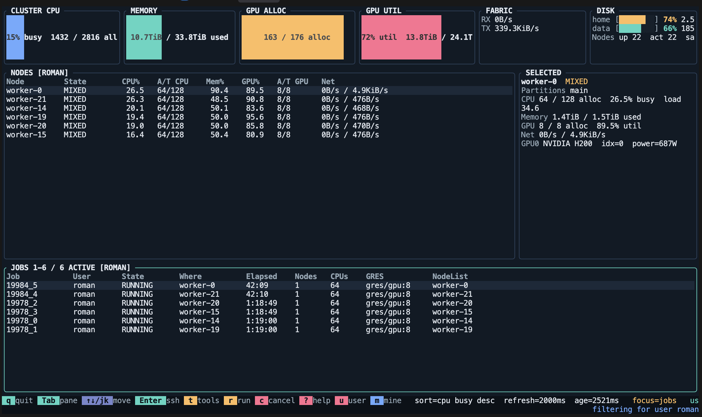

# ctop

`ctop` is a Slurm cluster monitor with a dense terminal UI in the spirit of `htop`, `btop`, and `nvtop`, but aimed at the whole cluster instead of one node.



## What it shows

- Scheduler capacity and allocation from `scontrol show node -o`
- Running and pending jobs from `squeue`
- Per-node live sampling for CPU, memory, network, and GPU over a persistent SSH probe to each node `NodeAddr`
- Shared `/home` and `/mnt/data` filesystem usage sampled locally on the machine running `ctop`
- Cluster-wide rollups plus sortable per-node and per-job tables

## Install

Quick install for Linux x86_64:

```bash
curl -fsSL https://raw.githubusercontent.com/photoroman/ctop/main/scripts/install.sh | bash
```

Install a specific release:

```bash
curl -fsSL https://raw.githubusercontent.com/photoroman/ctop/main/scripts/install.sh | CTOP_VERSION=v0.1.0 bash
```

The installer puts `ctop` into `~/.local/bin` by default. Override with `CTOP_INSTALL_DIR=/path/to/bin`.

Manual install from a GitHub release:

```bash
curl -fsSLO https://github.com/photoroman/ctop/releases/latest/download/ctop-x86_64-unknown-linux-gnu.tar.gz
tar -xzf ctop-x86_64-unknown-linux-gnu.tar.gz
install -m 0755 ctop ~/.local/bin/ctop
```

## Build

```bash
cargo run --release
```

Useful flags:

- `--refresh-ms 2000`
- `--max-sampled-nodes 64`
- `--active-only`
- `--no-remote`
- `--remote-timeout-secs 4`
- `--custom-tool-command "journalctl -f -u worker"`

## Controls

- `q`: quit
- `R`: refresh now
- `s`: cycle sort mode
- `S`: flip sort direction
- `a`: toggle active-only nodes
- `Tab`: switch focus between nodes and jobs
- `j` / `k` or arrow keys: move selection in the focused pane
- `PageUp` / `PageDown`: jump within the focused pane
- `Enter`: open an SSH session to the selected node, or to the first node of the selected job
- `t`: open the tools popup
- `?`: open the help popup
- `n`: run `nvtop` on the selected node or selected job node
- `b`: run `btop` on the selected node or selected job node
- `h`: run `htop` on the selected node or selected job node
- `r`: run the configured command on the selected node or selected job node
- `c`: cancel the selected job from the jobs pane after confirmation
- `u`: type a username filter inline, then press `Enter`
- `m`: toggle the `mine` filter for the current logged-in username

## Release

Push a tag like `v0.1.0` and GitHub Actions will build `ctop-x86_64-unknown-linux-gnu.tar.gz` and attach it to the release via `.github/workflows/release.yml`.

## Notes

- The first remote sample has no rate deltas yet, so network and precise CPU busy values settle after one refresh.
- Disk usage is sampled locally with `df -hP /mnt/data /home` and rendered only in the top-right summary card.
- The collector now keeps the last successful remote sample, so transient SSH misses do not blank the table.
- Live sampling now avoids `srun` and keeps a persistent SSH probe per sampled node, so it can still probe nodes that are fully allocated to other jobs without paying full SSH startup cost every refresh. Slurm is only used for cluster discovery and scheduler state.
- User filters apply to both the jobs pane and the nodes pane. Nodes stay visible when they host at least one matching job.
- `ctop` persists the last view state in `$XDG_CONFIG_HOME/ctop/state.json` or `~/.config/ctop/state.json`, including sort mode, sort direction, active-only, focus pane, and user filter.
- Passwordless SSH access to node IPs is required for live probes. If that path is unavailable, `--no-remote` still gives a scheduler-only overview.
- `scancel` must be available on the machine running `ctop` for job cancellation.
